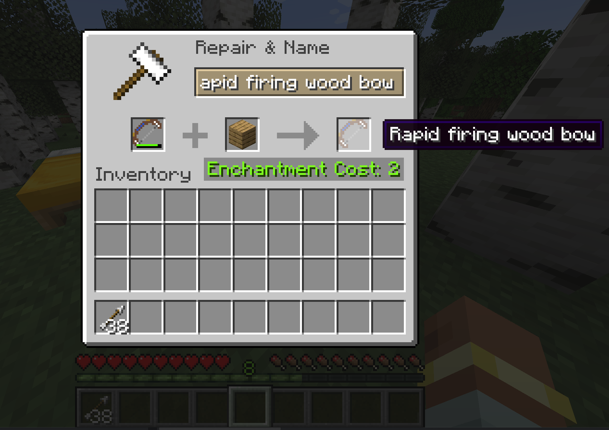
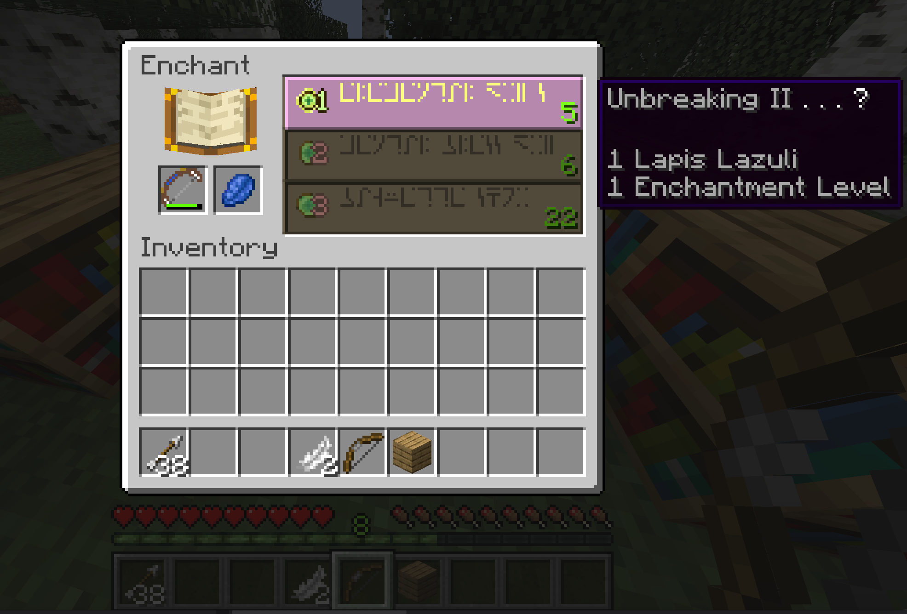

# Rapid Firing Bow

[日本語ガイド](./README_jp.md)

This mod allows you to use a bow that can fire continuously.
The intent is to allow for the effective use of bows and arrows obtained from trading with Fletcher.

## Feature

| Name                  | Number of continuous shots |
|:----------------------|:---------------------------|
| Rapid firing wood bow | 3                          |

## Create

* RapidFiringWoodBow: use `Planks`

## Repair

* RapidFiringWoodBow: use `Planks`

## Enchant

