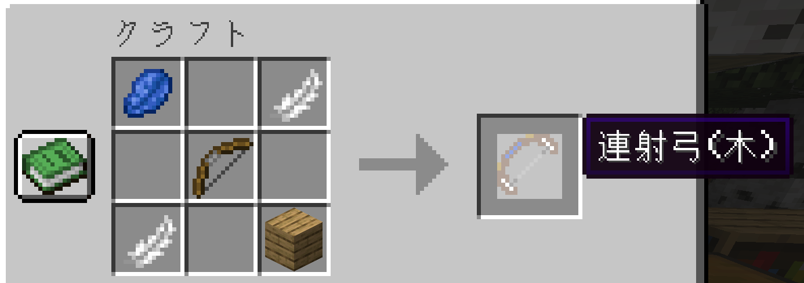
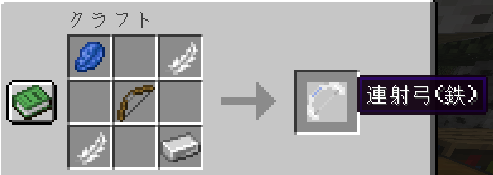
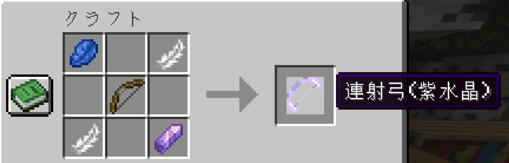
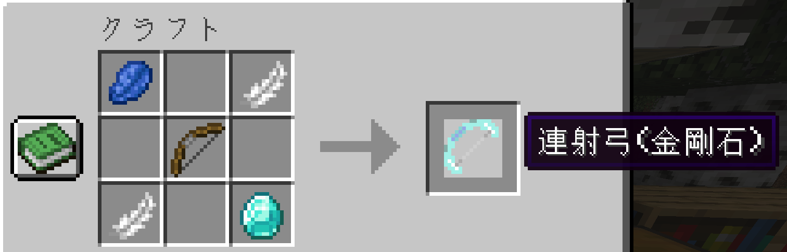
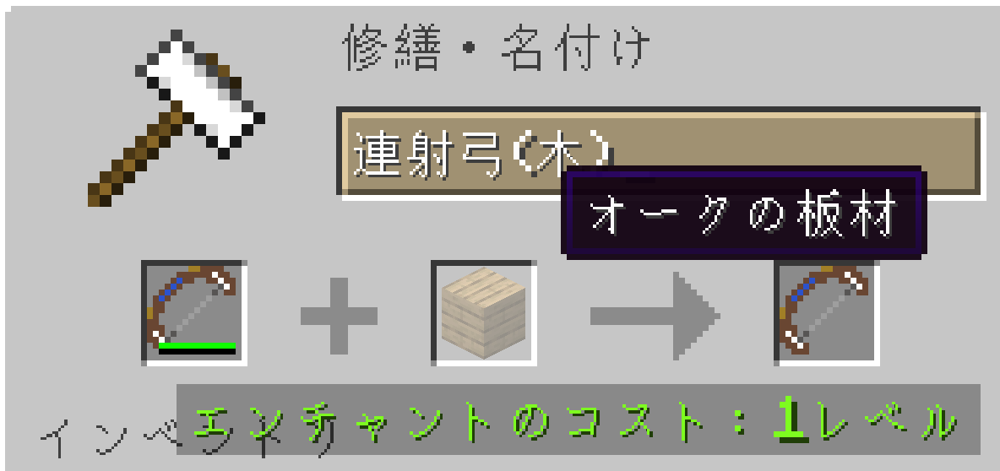
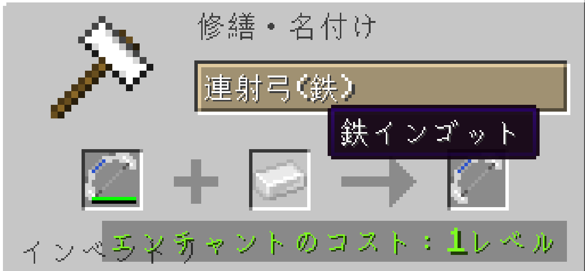
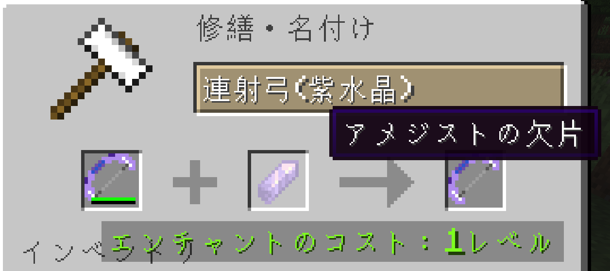
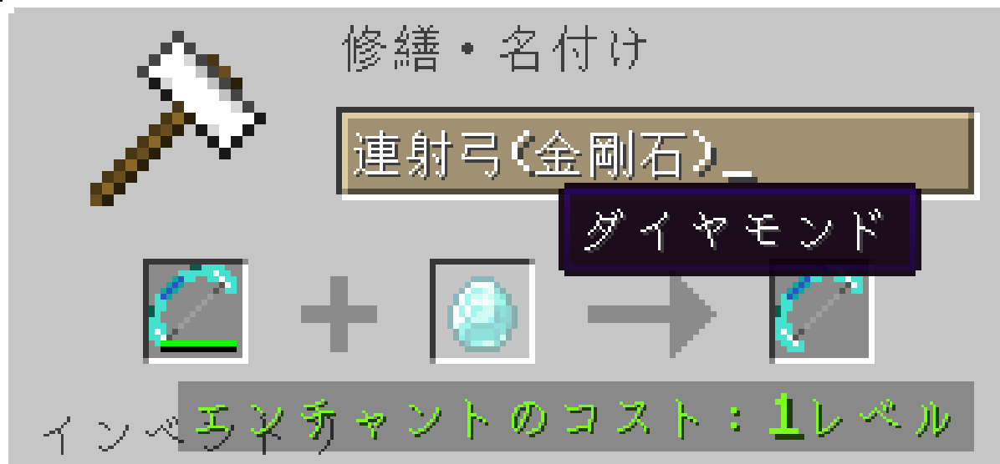
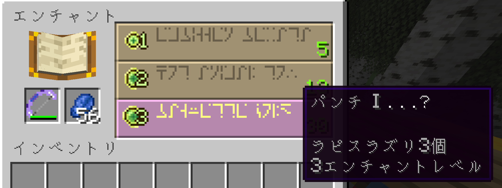

# 連射弓

[English guide](./README.md)

このMODを使うと、連射可能な弓を使えるようになります。  
矢師さんとの交易で手に入れた弓矢を、効果的に活用するのが目的です。

## 機能

| 名称       | 連射する矢の本数 | 連射の速度 | 耐久性   |
|:---------|:---------|:------|:------|
| 連射弓(木)   | 3        | とても遅い | とても低い |
| 連射弓(鉄)   | 5        | 遅い    | 中程度   |
| 連射弓(紫水晶) | 7        | とても速い | 低い    |
| 連射弓(金剛石) | 10       | 速い    | 高い    |

## 作成

連射弓の作成に必要となる素材は、弓・羽・ラピスラズリに加えて、それぞれの弓を特徴づける以下の素材です。

* 連射弓(木): 木の板材（何の木でもOK）
* 連射弓(鉄): 鉄インゴット
* 連射弓(紫水晶): アメジストの欠片
* 連射弓(金剛石): ダイアモンド

## 修理

修理に必要な素材も、作成の時と同様にそれぞれを特徴づける素材を使います。

* 連射弓(木): 木の板材（何の木でもOK）
* 連射弓(鉄): 鉄インゴット
* 連射弓(紫水晶): アメジストの欠片
* 連射弓(金剛石): ダイアモンド

## エンチャント

通常の弓と同様にエンチャントが可能です。  
木・鉄・紫水晶・金剛石と、作るのが難しい弓になるにつれて、エンチャント可能なスキルのレベルも上昇します。
