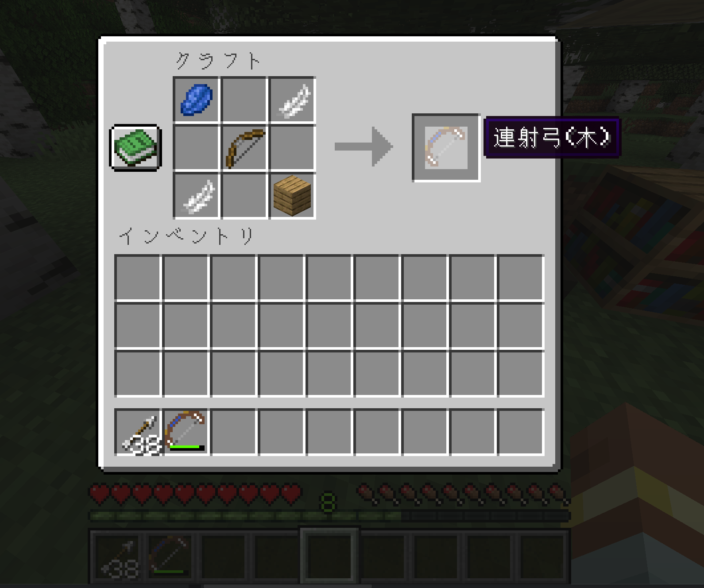
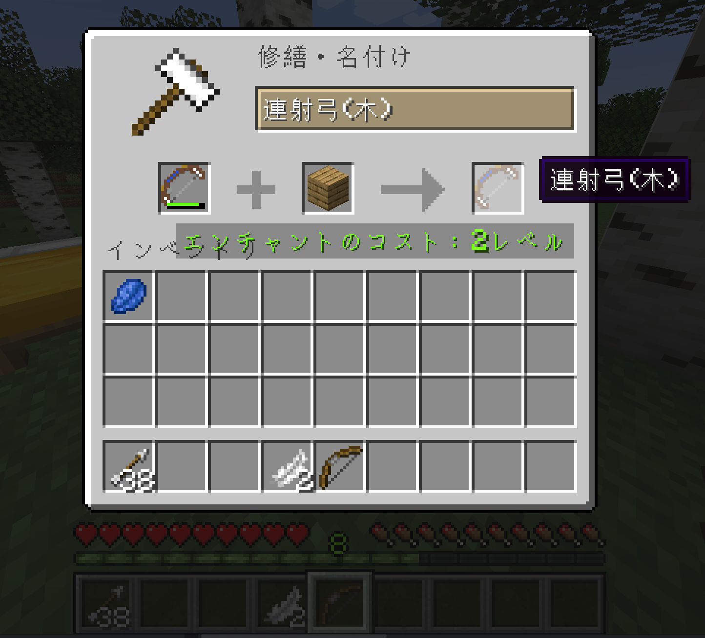
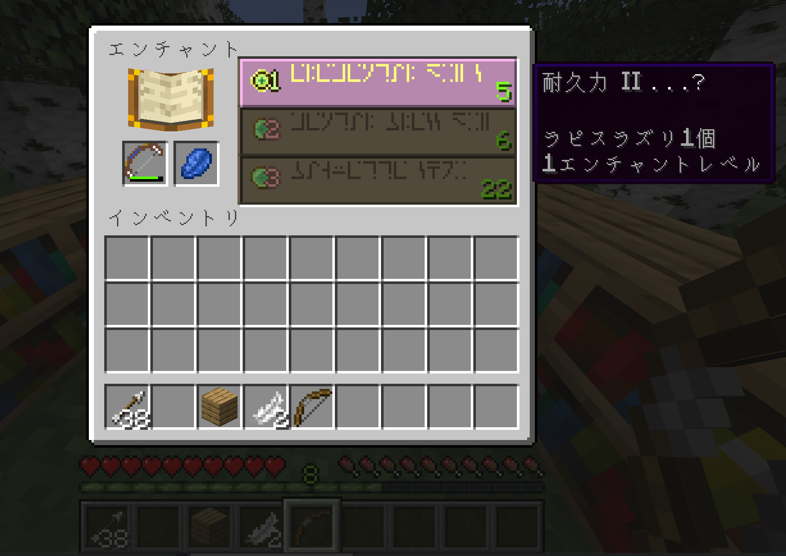

# 連射弓

[English guide](./README.md)

このMODを使うと、連射可能な弓を使えるようになります。
矢師さんとの交易で手に入れた弓矢を、効果的に使えるようにするのが目的です。

## 機能

| 名称     | 連射する矢の本数 |
|:-------|:---------|
| 連射弓(木) | 3        |

## 作成

* 連射弓(木): 板材を使います。

## 修理

* 連射弓(木): 板材を使います。

## エンチャント

